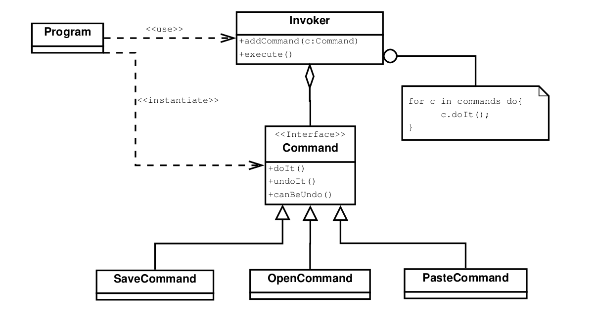

# Behavioral Patterns

## Command

### Intention

Encapsule une requête dans un objet, ce qui permet de créer des scripts utilisant ses commandes et de gérer les annulations
de commande (parfois compliquées).

### Conséquences

- Découple les objets qui invoquent l'opération de ceux qui peuvent l'exécuter.
- Transforme les commandes en _first-class object_ (>< mots réservés).
- L'ajout de nouvelles commandes est très simple (pas besoin de modifier les classes existantes).
- Facilite l'implémentation des processus de transaction.

### Patterns liés

Possibilité de créer des commandes qui sont des composites, pour exécuter des ensembles de commandes ou créer une 
hiérarchie. 