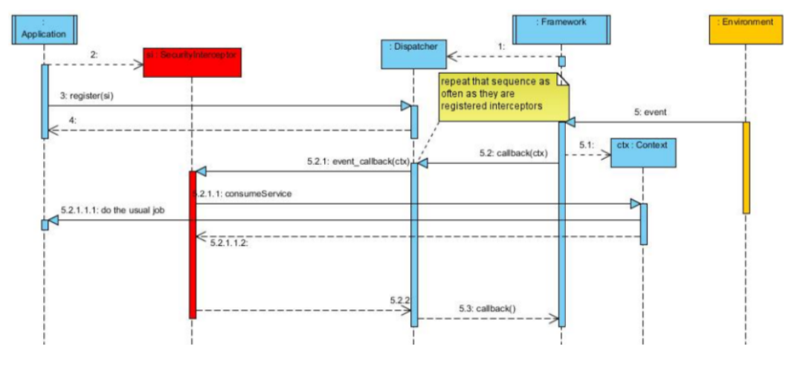

# Behavioral Patterns

## Interceptor

### Intention

Étend ou affine dynamiquement la fonctionnalité d'un composant (par exemple de nouvelles fonctionnalités de sécurité).

### Motivation

Fonctionnement puissant, à l'éxécution, qui n'est pas trop compliqué à mettre en oeuvre.

### Structure

L'objet (framework) fournit une forme d'API (le dispatcheur) qui permet à l'intercepteur d'accéder à ses données.
Quand l'application exécute une action (via le dispatcheur), l'intercepteur instancié voit passer les requêtes et 
décide ou non de les altérer. L'événement perçu est réifier dans un objet contexte qui permet à l'intercepteur de 
décider du cours des événements.

### Conséquences

- \+ Extensible et flexible
- \+ Séparation des aspects (transaction, sécurité, persistance, réplication, ...)
- \+ Facilite le monitoring des applications (administration, audit)
- \+ Réutilisation plus aisée (meilleure découpe)
- \- Difficulté de modélisation du contexte pour prendre tous les éléménts importants en compte (et ne pas perdre en 
performance)
- \- Perte d'efficacité dans certains cas.
- \- Si plusieurs intercepteurs, ils risquent de se marcher sur les pieds (effet de bord, entre les intercepteurs et avec
l'application)
- \- Attention au boucle infinie: il faut parfois by-passer l'intercepteur pour éviter que ce qu'il renvoie ne le traverse
à nouveau

### Usages connuus

Souvent utilisé dans le contexte des frameworks et des middlewares car il apporte une grande généricité.

### Patterns liés

Le décorateur est similaire mais les fonctions sont rajoutées au-dessus et non pas à l'intérieur du système existant.