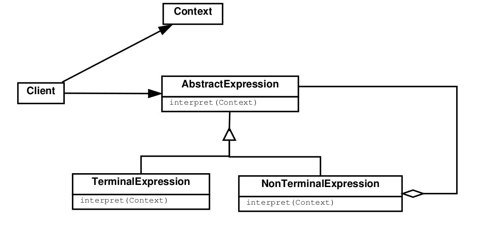

# Behavioral Patterns

## Interpreter

### Intention

Permet de définir une représentation d'une grammaire et un interpréteur d'un langage.

### Structure

Chaque expression évaluée selon le contexte qu'on lui passe en argument et renvoie le contexte mis à jour.

### Application

Permet de fournir un prototype d'interpréteur pour une grammaire simple (une hiérarchie trop compliquée est impossible
à gérer, mieux vaut utiliser des générateurs de parseurs) et pour lequel l'efficacité n'est pas un concept primordial.

### Patterns liés

Visiteur (permet de parcourir l'expression en gardant un état cumulatif pour le contexte), composite.