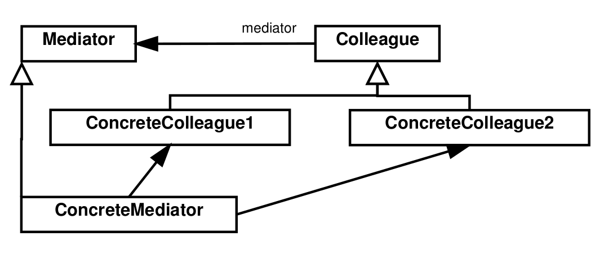

# Behavioral Patterns

## Mediator

### Intention

Permet de définir un objet qui encapsule les intéractions entre les différents objets. Il permet d'affaiblir le couplage
en supprimant les références explicites ce qui permet de varier les interaction indépendamment.

### Conséquences

- Limite le sous-classement: la sous-classe qui permet de changer le comportement est uniquement une sous-classe du 
médiateur.
- Affaiblit le couplage.
- Simplifie les protocoles d'objets.
- Abstrait la façon dont les objets coopèrent.
- Centralise le contrôle.
- Appels indirects (augmente donc le nombre de communications puisque tous les échanges doivent passer par le médiateur).

### Patterns liés

Le pattern de configuration fonctionne un peu de la même façon, mais uniquement pour la configuration des objets alors
que le médiateur fonctionne durant toute l'exécution.