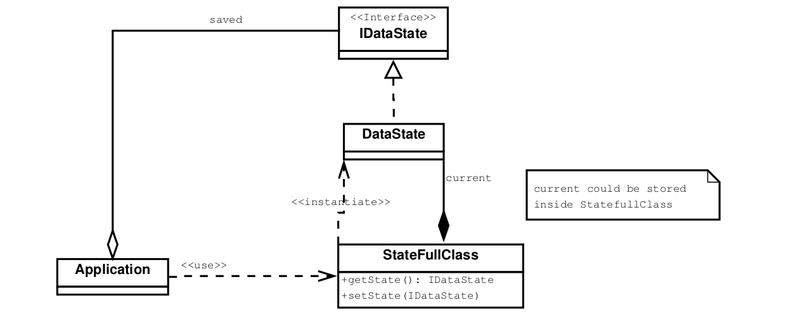

# Behavioral Patterns

## Memento

### Intention

Capturer et externaliser l'état interne d'un objet afin que l'objet puisse être restauré à cet état plus tard, le tout
sans violer l'encapsulation.

### Structure

L'application utilise les méthodes de la classe _StatefullClass_ pour prendre des snapshots. Ces snapshots sont des 
_DataState_, une classe privée, uniquement accessible via son interface (qui ne possède pas de méthodes). L'application
enregistre une collection de _IDataState_. Pour restaurer un des états précédents, elle doit faire appel à la fonction 
_get_ de la classe _StateFullClass_