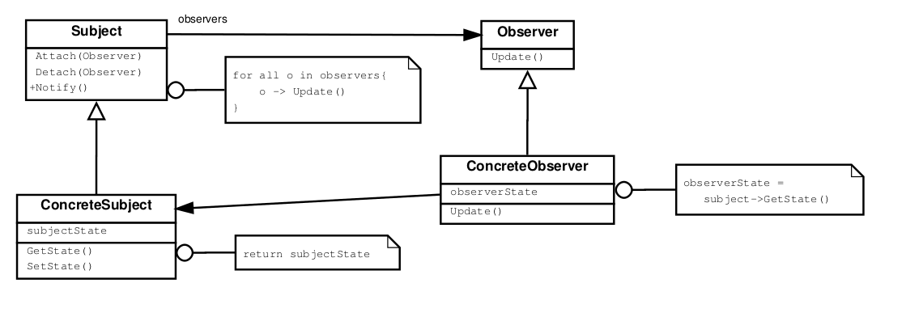

# Behavioral Patterns

## Observer

### Intention

Défini une dépendance "one-to-many" entre les objets pour qu'une modification sur un objet soit notifiée et mise-à-jour
automatiquement dans ses dépendances.

### Application
À utiliser quand

- Une abstraction a deux aspects qui dépendent l'un de l'autre, ce qui permet de les encapsuler séparément.
- Quand un changement sur un objet nécessite une modification des autres objets (et que l'on ne sais pas combien doivent
évoluer).
- Quand un objet doit être capable de modifier d'autres objets sans faire d'hypothèse sur ces autres objets (pour éviter
un couplage fort).

### Conséquences

- Couplage abstrait entre un sujet et un observateur (à sens unique: observateur -> objet)
- Supporte les communications en multicast: les notifications sont envoyées à tous les observateurs "abonnés".
- Mise-à-jour inattendues: sans protocole supplémentaire, il est difficile pour les observateurs de définir ce qui a changé.