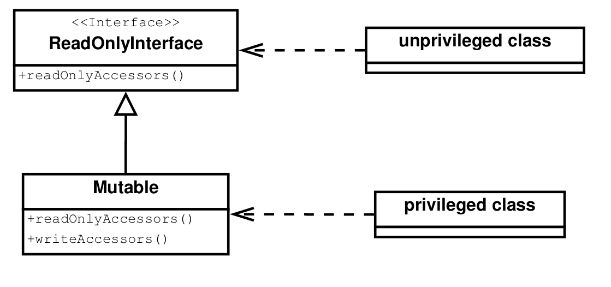

# Behavioral Patterns

## Read-Only Object

### Intention

Contrôle la façon dont l'utilisateur peut accéder à un objet. Sorte de compromis entre un objet mutable et immutable (
suivant le contexte, on choisit l'accessibilité autorisée).

### Patterns liés

Peut être mis en lien avec les patterns _Proxy_, _Factory_ et _Memento_ et à comparer avec les patterns _Immutables_ et 
_Role Player_.