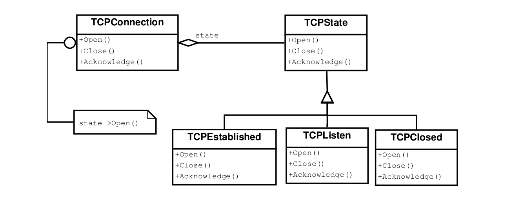

# Behavioral Patterns

## State

### Intention

Permettre à un objet de modifier son comportement lorsque son état interne change. L'objet semblera changer de classe.

### Conséquences

- \+ Regrouper tous les comportements liés à un état particulier dans une seule classe, ce qui facilite la créaton de 
nouveaux états et transitions.
- \+ Distribue des comportements pour différents états à travers plusieurs sous-classes d'état (augment le nombre de 
classes, mais diminue la taille des conditions).
- \+ Rend les changements d'état explicites.
- \+ les objets d'état peuvent être partagés.

### Conseil d'implémentation

- Ce pattern ne gère pas les changements d'états. C'est dans l'impléméntation (propre au langage utilisé) que l'on 
changera l'état.
- Deux choix d'implémentation possible:
    - Créer les états seulement quand on en a besoin et les détruire dès qu'ils ne sont plus utilisés (utile si les états 
    ne sont pas connus et/ou que le contexte varie peu).
    - Créer les états à l'avance et ne jamais les détruire (utile si les états sont connus et/ou le contexte change
    fréquemment).
-Certains langages permettent de changer le type de l'objet à l'exécution (héritage dynamique, ex: le langage de
prototypage self).

### Patterns liés

Flyweight (permet d'optimiser en diminuant le nombre d'états possibles).