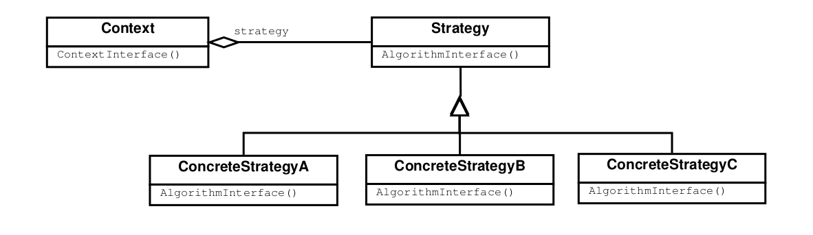

# Behavioral Patterns

## Strategy

### Intention

Défini une famille d'algorithmes encapsulés et interchangeables. Ce pattern permet de gérer l'algorithme indépendamment
du client qui l'utilise. C'est le contexte qui définira quelle implémentation choisir.

### Conséquences

- Familles d'algorithmes apparentés. On peut utiliser l'héritage pour factoriser les fonctionnalités communes de certains
algorithmes.
- Alternative au sous-classement.
-Élimine des instructions conditionnelles.
- Permet plusieurs choix d'implémentation, avec différents coûts en temps et en espace.
- Le clien doit connaître les bénéfices/inconvénients des différentes stratégies pour pouvoir choisir laquelle convient
le mieux.
- Les communications entre la stratégie et le contexte engendrent des coûts (il est parfois nécessaire de créer des 
paramètres qui ne seront jamais utilisés dans la pratique).
- Augmente le nombre d'objets

### Patterns liés 

Bridge (fonctionne, mais s'occupe de l'exécution et non de l'algorithmique de création), State (ressemble fort, mais l'un
se base sur les états de l'objet, l'autre sur le contexte).
