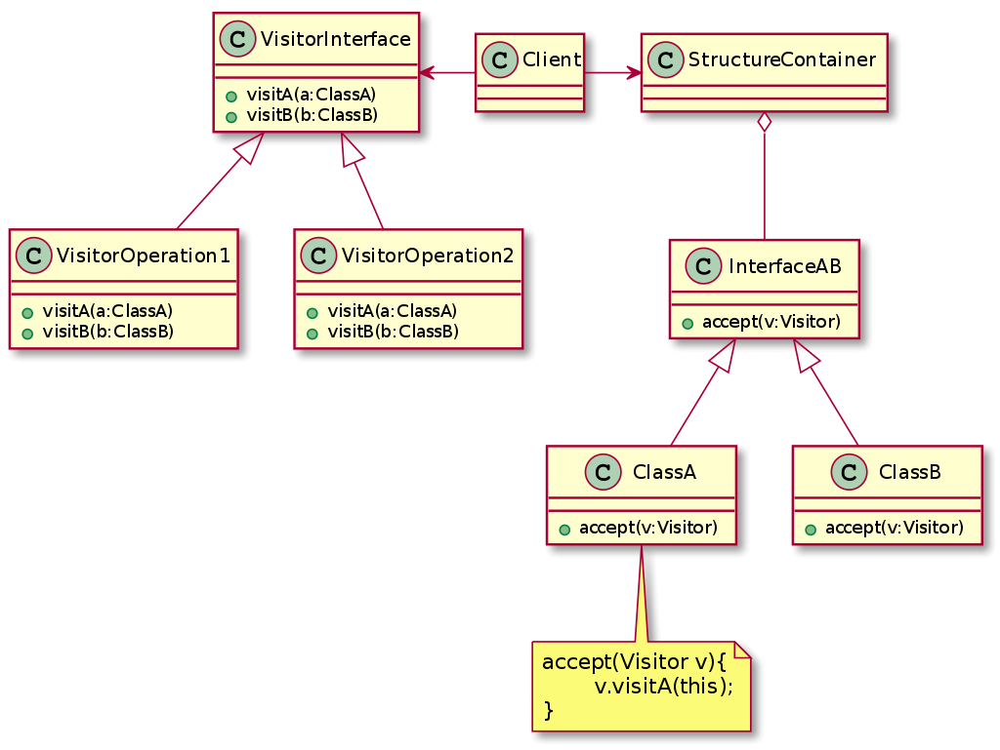

# Behavioral Patterns

## Visitor

### Intention

Représente une opération à exécuter sur les éléments d'une structure de données. Le visiteur permet de définir de 
nouvelles opérations sans changer les classes des éléments sur lesquels elles opèrent.

### Structure

Le noeud visiteur possède autant de classe qu'il n'y a de classes dans la structure de données. chaque sous-type du
visiteur possède une implémentation différente de ces méthodes. L'accompagnateur est le code applicatif qui lie ces 
objets: il parcoure les objets avec les visiteurs adéquats. C'est l'accompagnateur qui choisi l'ordre de parcours de la
stucture de données. Chacune des classes de données contient une métode "accept" qui lui permet d'accepter la visite
d'un visiteur.

### Conséquences

- \+ Les méthodes de gestion de la structure de données sont séparées des méthodes de calcul sur ces données.
- \+ Ajouter de nouvelles opérations est assez simple
- \+ Le visiteur rassemble les opérations liées et sépare les autres
- \+ Le visiteur peut accumuler des informations au fur et à mesure de ses visites: il permet d'accumuler des états qui 
autrement devraient être gérées par des transferts d'arguments dans les opérations de traversée ou par des variables
 globales.
- \- Ajouter de nouvelles classes concrètes est compliqué car il faut ajouter une nouvelle méthode dans chaque visiteur.
- \- Le principe d'encapsulation est enfreint: l'interface qui gère les classes concrètes doit être assez puissante pour
que le visiteur puisse faire ce qui lui est demandé (opérations publiques).
- \- La traversée de la structure est contrôlée par le client et non par le visiteur, qui pourrait pourtant avoir besoin
de stratégies spécifiques de traversée.

### Patterns liés

Le pattern stratégie permet de régler la faiblesse de ce couplage entre le visiteur et le client.
