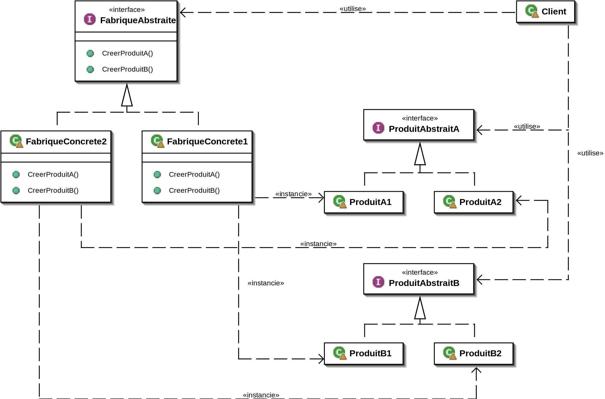

# Creational Patterns

## AbstractFactory

### Intention

Fournit une interface pour créer des familles d'objets apparentés ou dépendants sans spécifier leur classe concrête.

### Applications:

À utiliser quand:

- Un système doit être indépendant de la façon dont ses produits sont créés, composés et représentés.
- Un système doit être configuré avec l'une des multiples familles de produits.
- Une famille d'objets de produits connexes est conçue pour être utilisée ensemble, et vous devez appliquer cette contrainte.
- Vous voulez fournir une bibliothèque de classes de produits, et vous voulez réveler juste leur interface, pas leur implémentation.

### Conséquences

- \+ isole les classes concrètes
- \+ Facilite l'échange de familles de produits
- \+ Favorise la cohérence entre les produits
- \- Supporter de nouvelles sortes de produits est difficile.  