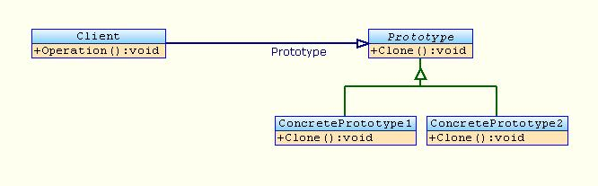

# Creational Patterns

## Prototype

La classe Prototype sert de modèle principal pour la création de nouvelles copies. Les classes ConcretePrototype1 et ConcretePrototype2 viennent spécialiser la classe Prototype en venant par exemple modifier certains attributs. La méthode clone() doit retourner une copie de l'objet concerné. Les sous-classes peuvent hériter ou surcharger la méthode clone(). La classe Client va se charger d'appeler les méthodes de clonage via sa méthode operation().

### Intention

Autre mécanisme pour créer un objet que de passer par une classe et un constructeur.

### Motivation

On cherche à créer un grand nombre d'objets très semblables, qui ne se distinguent que oar une petite adaptation (exemple: des portes en bois dont seule la couleur et le numéro changent.)
On pourrait créer et implémenter des classes pour chaque type d'objet (porte ouvrant à gauche, porte ouvrant à droite, etc.) ou simplement créer des objets ad-hoc et les cloner. Je peux ensuite le configurer (couleur, taille,...)

### Exemple

Exemple où prototype s'applique : supposons une classe pour interroger une base de données. À l'instanciation de cette classe on se connecte et on récupère les données de la base avant d'effectuer tous types de manipulation. Par la suite il sera plus performant pour les futures instances de cette classe de continuer à manipuler ces données que de réinterroger la base. Le premier objet de connexion à la base de données aura été créé directement puis initialisé. Les objets suivants seront une copie de celui-ci et donc ne nécessiteront pas de phase d'initialisation.