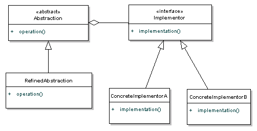

# Structural Patterns

## Bridge

### Intention

Découpler une abstraction de son implémentation pour pouvoir faire varier les deux de façon indépendante.

### Motivation

Le moyen habituel pour permettre à une abstraction d'avoir deux implémentations distinctes est d'utiliser le principe d'héritage. Cependant
, cette approche n'est pas toujours assez flexible. L'héritage lie de façon permanente une implémentation à une abstraction, ce qui ne permet pas d'étendre, de modifier
ou de réutiliser facilement les abstractions et les implémentation indépendamment les unes des autres. Le choix se fait au 
moement de la construction (le choix n'est plus changé après.)

### Conséquences

- Découple l'interface de l'implémentation
    - Une implémentationn'est pas liée de façon permanente à une interface. L'implémentation d'une abstraction peut être configurée à l'exécution.
    - Élimine les dépendances de compilation de l'implémentation: on peut la modifier sans devoir recompiler les classes d'abstraction et leurs clients.
- Encourage la découpe en couches pour une meilleure structure du système.
- Améliore l'extensibilité.
- Cache les détails d'implémentation au client.

### Patterns liés

Reprends certains éléments du proxy et de la stratégie.