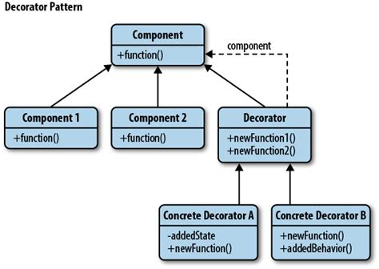

# Structural Patterns

## Decorator

### Intention

Ajoute dynamiquement de nouvelles responsabilités à un objet, alternative flexible
au mécanisme de sous-classement pour étendre les fonctionnalités. Il 
faut par contre penser à mettre à jour l'environnement
pour que le système se rende compte que l'on a ajouté un décorateur sur un objet (petite faiblesse du pattern).

### Patterns liés

Proxy