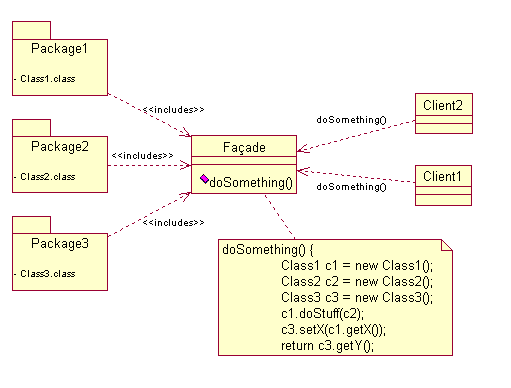

# Structural Patterns

## Facade

### Intention 

Fournir une interface haut-niveau pour cacher un code plus compliqué.

### Application 

A utiliser pour:

- Fournir une interface simple à un système complexe.
- Découpler le sous-système des cleints et les autres sous-systèmes, favorisant ainsi l'indépendance et la portabilité du sous-système.
- Créer un système  en couche. La facade peut alors servir de point d'entrée à chaque sous-système.