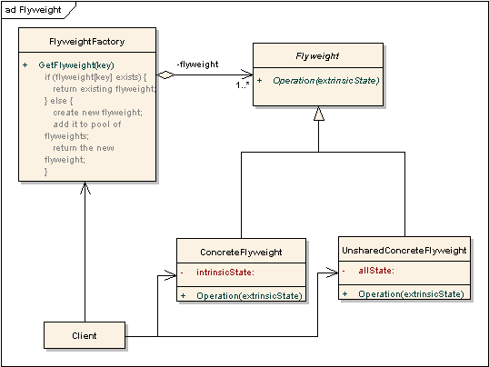

# Structural Patterns

## Flyweight

Comprendre uniquement l'idée générale)

### Intention 

Ramener un grand nombre d'objets identiques dans un seul objet.

### Motivation

Les informations spécifiques sont enregistrés dans l'appelant et non dans l'objet lui-même. (
ex: passer de 30000 objets à 26 pour l'alphabet.
)