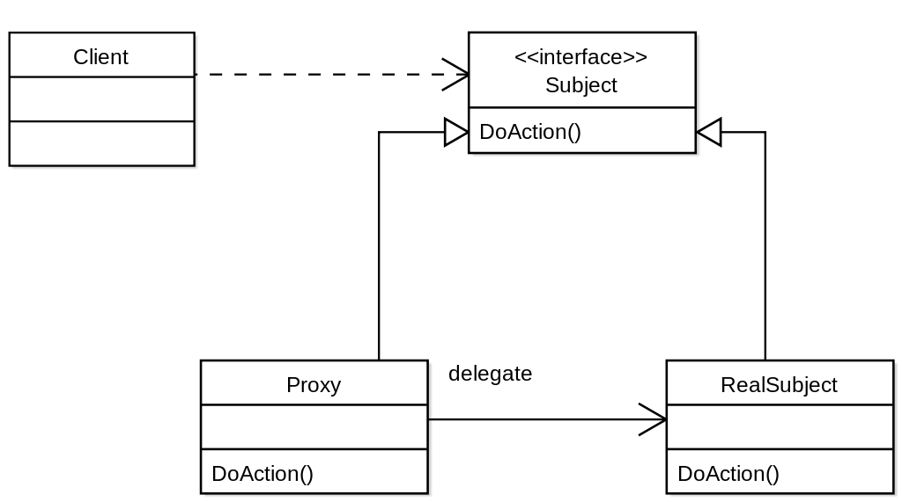

# Structural Patterns

## Proxy

### Intention

Fournir un substitut pour un autre objet afin de contrôler l'accès à celui-ci. Le proxy peut être utilisé pour masquer 
des mécanismes complexes (objets distribués), pour ajouter de nouvelles fonctionnalités (adaptateurs, voir décorateurs),
ou pour agir en tant que mécanisme de mise en cache. L'idée est d'avoir une interface commune à l'objet réel et au proxy. 
Le proxy référence toutes les méthodes de l'objet réel et un constructeur contenant l'objet référencé.

### Propriétés

- Un proxy est un cas particulier du patron de conception état;
- Un proxy implémente une et une seule interface (donc une seule classe);
- Un état peut implémenter un nombre quelconque d'interfaces;
- Un état est utilisé pour changer dynamiquement l'interface.

### Patterns liés

Décorateur (proxy qui ajoute des fonctionnalités.)